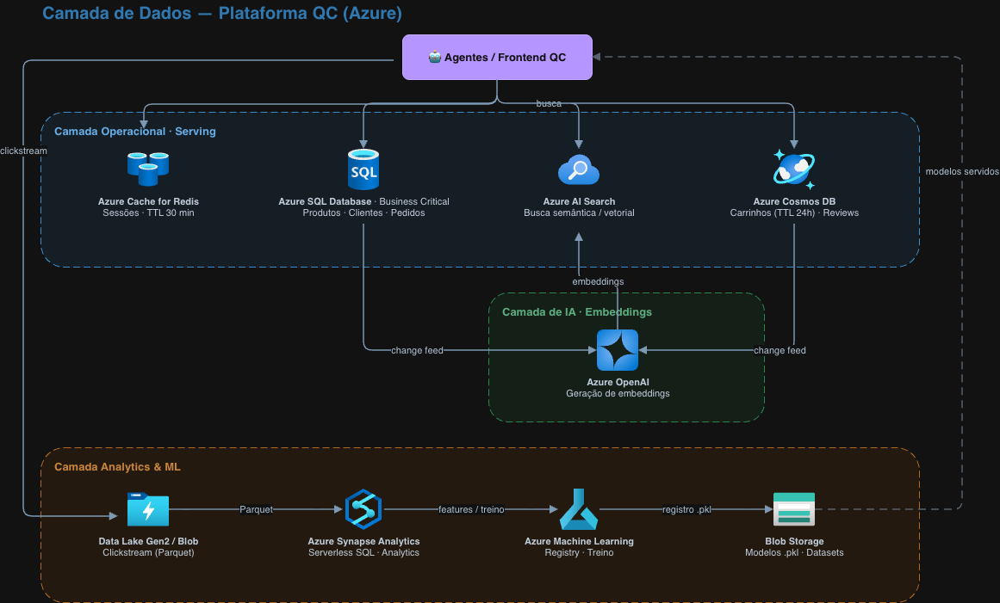

# Entrega de Grupo — Aula 2: Storage & Bancos de Dados na Nuvem

**Disciplina:** Cloud & Cognitive Environments — MBA AI Engineering & Multi-Agents (FIAP)

**Professor:** Elthon Freitas

**Grupo:** TenhoMedoDeGrupos

## 📋 Pendências de medição (N3)

Itens que ainda precisam ser **executados e preenchidos** com os números reais do nosso ambiente
(marcados com `⟵ PREENCHER` no texto). Clique em **ir** para pular direto ao ponto; troque ⬜ por ✅ ao concluir.

| # | Item a testar / preencher                                              | Ex. | Como obter                          | Status | Ir                          |
|---|------------------------------------------------------------------------|-----|-------------------------------------|--------|-----------------------------|
| 1 | Top-3 + scores das 3 queries de vector search                          | 3.1 | rodar `scripts/vector_search.py`    | ⬜      | [ir](#pend-31-resultados)   |
| 2 | Ajustar o texto de comparação (vector × semantic) com o resultado real | 3.1 | após o item 1                       | ⬜      | [ir](#pend-31-comparacao)   |
| 3 | Bytes processados pela query no Synapse                                | 3.2 | aba **Resultados** no Synapse Studio | ⬜      | [ir](#pend-32-bytes)        |
| 4 | Latência média (10 queries) — SQL, Cosmos, AI Search                   | 3.3 | benchmark das 3 opções              | ⬜      | [ir](#pend-33-latencias)    |
| 5 | Fechar a recomendação com os números medidos                           | 3.3 | após o item 4                       | ⬜      | [ir](#pend-33-recomendacao) |

## Grupo

| # | Nome completo                      | GitHub          | E-mail FIAP                                            |
|---|------------------------------------|-----------------|--------------------------------------------------------|
| 1 | Tiago da Silva Brilhante           | tiagobrilhante  | contato@brilhante.dev.br<br/>rm373145@fiap.com.br      |
| 2 | Gabriel Moreira Do Nascimento      | Gabriel22880033 | biel.djc603@gmail.com<br/>rm372936@fiap.com.br         |
| 3 | Andrew Augusto Jungers da Silva    | Andrew470-coder | andrewaugustolink@hotmail.com<br/>rm373216@fiap.com.br |
| 4 | Getter Benedito de Matos Fernandes | Getterbmf       | getterbmf@gmail.com<br/>rm373056@fiap.com.br           |

## Distribuição do trabalho

| Membro                             | RM     | Nível trabalhado | Rodízio (o que fez na Aula 1) |
|------------------------------------|--------|------------------|-------------------------------|
| Tiago da Silva Brilhante           | 373145 | 🔴 N3            | 🟢 N1 · 🔴 N3                 |
| Gabriel Moreira Do Nascimento      | 372936 | 🟡 N2            | 🟢 N1                         |
| Andrew Augusto Jungers da Silva    | 373216 | 🟢 N1            | 🟡 N2 · 🔴 N3                 |
| Getter Benedito de Matos Fernandes | 373056 | 🟡 N2  · 🔴 N3   | 🟡 N2                         |

---

---

## 🟢 Nível 1 — Básico: Consolidando os Fundamentos

---

### Exercício 1.1 — Tipos de Storage

```text
Para cada cenário, escolha Object Storage, File Storage ou Block Storage e justifique em uma frase.
```

| Cenário                          | Tipo                                      | Justificativa                                                                                                    |
|----------------------------------|-------------------------------------------|------------------------------------------------------------------------------------------------------------------|
| Imagens de produtos (5M SKUs)    | **Object**                                | Arquivos imutáveis servidos por HTTP em escala; não precisam de sistema de arquivos nem de um SO montando disco. |
| Disco do SO da VM de banco       | **Block**                                 | O SO precisa de I/O de baixa latência em blocos, atrelado a uma única VM (managed disk).                         |
| Pasta compartilhada entre 10 VMs | **File**                                  | Precisa ser montada simultaneamente por várias VMs via SMB/NFS (ex.: `/mnt/dados`).                              |
| Backup mensal, retenção 7 anos   | **Object — Archive tier**                 | Acesso raríssimo e retenção longa; o custo por GB despenca no Archive.                                           |
| Modelos `.pkl` de ML p/ serving  | **Object**                                | Blobs versionados baixados por HTTP pelos serviços de serving; não exige filesystem.                             |
| Dump diário de logs p/ análise   | **Object com lifecycle Hot→Cool→Archive** | Escrita append constante + leitura analítica serverless (Synapse) direto no Blob.                                |

---

### Exercício 1.2 — Tiers de acesso (cálculo)

```text

A Quantum Commerce armazena 2 TB de logs de compras. Os primeiros 30 dias os logs são consultados para detecção de fraude (Hot). 
Depois disso, viram dados arquivados de compliance LGPD (Archive, retenção 5 anos).

a) Quanto custaria 1 mês desses logs se mantidos 100% em Hot tier? (Use ~$0,018/GB/mês) 
b) Quanto custaria 1 mês desses logs com lifecycle: 30 dias Hot + Archive depois? (Archive ~$0,002/GB/mês) 
c) Economia anual com a lifecycle policy?

```

Dados: 2 TB = **2.048 GB**. Hot ≈ $0,018/GB·mês. Archive ≈ $0,002/GB·mês (rate do enunciado).

**a) 100% Hot, 1 mês:**
`2.048 × 0,018 = $36,86/mês` (≈ $442/ano).

**b) Lifecycle (30 dias Hot, depois Archive), média em steady state:**
Cada bloco de log passa ~30 dias em Hot e o resto do ano em Archive. Fração Hot = 30/365; fração Archive = 335/365.

- Hot: `2.048 × (30/365) × 0,018 = $3,03/mês`
- Archive: `2.048 × (335/365) × 0,002 = $3,76/mês`
- **Total ≈ $6,79/mês**

**c) Economia anual:**
`($36,86 − $6,79) × 12 = $30,07 × 12 ≈ $360/ano`

> **Observação:** o rate real do Archive em 2026 já está em ~$0,001/GB (metade do usado aqui), então a
> economia real é ainda maior. E para os volumes reais da QC (centenas de TB de logs), a mesma política escala para *
*seis
dígitos de economia por ano**.

---

### Exercício 1.3 — Relacional vs NoSQL

```text
Para cada caso de uso da Quantum Commerce, marque qual tipo de banco é mais adequado e justifique:
```


| Caso de uso                         | Escolha                                 | Justificativa                                                                                                    |
|-------------------------------------|-----------------------------------------|------------------------------------------------------------------------------------------------------------------|
| Carrinho ativo                      | **NoSQL doc (Cosmos)**                  | Esquema variável, leitura/escrita muito rápida, expira sozinho (TTL).                                            |
| Catálogo (SKU, preço, estoque)      | **Relacional (Azure SQL)**              | Esquema fixo, joins com categorias, integridade transacional de estoque.                                         |
| Reviews (texto + score)             | **NoSQL doc (Cosmos)**                  | Texto livre sem schema rígido; alto volume de documentos.                                                        |
| "Produtos similares" (recomendação) | **Vector DB (AI Search)**               | Similaridade semântica por embeddings, não por igualdade exata.                                                  |
| Histórico de pedidos (faturamento)  | **Relacional (Azure SQL)**              | ACID obrigatório (faturamento exige garantias transacionais).                                                    |
| Sessão (key-value, expira 30min)    | **Redis** (ou Cosmos c/ TTL)            | Key-value em memória, latência sub-ms; TTL nativo. Cosmos é o mais próximo entre as 3 opções da tabela original. |
| Logs de navegação                   | **Object Storage + Synapse** (ou NoSQL) | Volume massivo append-only; melhor consultar em Blob/Parquet com analytics serverless que carregar num banco.    |

---

### Exercício 1.4 — Key Vault e RBAC

```text
Você acabou de provisionar o Key Vault da Aula 2. Para cada perfil, escolha a role built-in e justifique:
```

| Perfil                                 | Role built-in                                                                      | Justificativa                                                                                     |
|----------------------------------------|------------------------------------------------------------------------------------|---------------------------------------------------------------------------------------------------|
| Você (dev + ops, criador)              | **Key Vault Secrets Officer**                                                      | CRUD completo em segredos sem precisar ser Owner do recurso (menor privilégio no plano de dados). |
| Azure Function lendo connection string | **Key Vault Secrets User** (via **Managed Identity**)                              | Só leitura de segredos; identidade gerenciada evita guardar credencial no código.                 |
| Engenheiro de segurança (auditoria)    | **Key Vault Reader**                                                               | Lê metadados e configuração do Vault, **sem** ver os valores dos segredos.                        |
| Pipeline de CI/CD injetando segredos   | **Key Vault Secrets Officer** com **Service Principal dedicado** e escopo restrito | Precisa criar/atualizar segredos, mas isolado numa identidade própria e auditável.                |
| FinOps (ver custo, não segredos)       | **Reader no Resource Group**                                                       | Enxerga custo no Cost Management sem qualquer acesso ao plano de dados do Vault.                  |

---

---


## 🟡 Nível 2 — Intermediário: Decisões Arquiteturais

---

### Exercício 2.1 — Modelagem de dados da QC (em grupo)

```text
A Quantum Commerce tem os seguintes domínios:

- Produtos (catálogo: 5M SKUs)
- Clientes (~50M de clientes ativos, perfil + endereço + preferências)
- Pedidos (~10M/mês, alta criticidade transacional)
- Carrinhos ativos (~500k a qualquer momento, expiram em 24h)
- Reviews (~30M de textos livres, alimentam análise de sentimento)
- Busca de produtos (consultas dos agentes + frontend)
- Sessões de usuário (~1M ativas)
- Histórico de navegação (clickstream — bilhões de eventos)
- Modelos de ML (recomendação, classificação, predição de churn)
- Sua tarefa: Preencha a matriz de decisão abaixo:
```


| Domínio                              | Serviço Azure                                          | SKU / Configuração                       | Justificativa                                                                                                                 |
|--------------------------------------|--------------------------------------------------------|------------------------------------------|-------------------------------------------------------------------------------------------------------------------------------|
| **Produtos** (5M SKU)                | Azure SQL Database                                     | Hyperscale (ou GP se caber)              | Esquema fixo, joins com categorias/estoque e integridade transacional; Hyperscale escala storage sem re-provisionar.          |
| **Clientes** (50M)                   | Azure SQL Database                                     | Hyperscale, zone-redundant               | Cadastro estruturado (perfil + endereço) com integridade referencial; preferências mais soltas podem ir para uma coluna JSON. |
| **Pedidos** (10M/mês, crítico)       | Azure SQL Database                                     | Business Critical, zone-redundant        | ACID e alta disponibilidade obrigatórios — é a espinha dorsal do faturamento.                                                 |
| **Carrinhos** (500k, expiram 24h)    | Azure Cosmos DB (NoSQL)                                | Autoscale RU/s + **TTL = 24h**           | Documento de esquema variável, leitura/escrita rápida e expiração automática sem job de limpeza.                              |
| **Reviews** (30M texto livre)        | Azure Cosmos DB (NoSQL doc)                            | Autoscale, particionado por `produto_id` | Texto sem schema, alto volume; feed natural para análise de sentimento.                                                       |
| **Busca de produtos**                | Azure AI Search                                        | Standard **S1** + semantic/vector        | Full-text + ranking semântico + vector search para os agentes e o frontend.                                                   |
| **Sessões** (1M ativas)              | Azure Cache for Redis                                  | Standard/Premium, TTL 30min              | Key-value em memória, latência sub-ms — ideal para estado efêmero de sessão.                                                  |
| **Histórico de navegação** (bilhões) | Data Lake Storage Gen2 (Blob) + Event Hubs na ingestão | Parquet, lifecycle Hot→Cool              | Clickstream é append-only massivo; consultar em Parquet com Synapse Serverless evita carregar num banco caro.                 |
| **Modelos ML** (`.pkl`)              | Azure Blob (+ Azure ML Model Registry)                 | Hot, versionamento por blob              | Download por HTTP no serving; o Model Registry adiciona governança/linhagem dos modelos.                                      |

**Diagrama da camada de dados (bônus):** o grupo desenhou no draw.io e exportou como `diagrama_exercicio_2_1.png`.

[](diagramas/diagrama_exercicio_2_1.png)

> 📎 [Abrir o diagrama em tamanho cheio](diagramas/diagrama_exercicio_2_1.png)

---

### Exercício 2.2 — Plano de migração de dados


```text
A Quantum Commerce hoje tem:

Banco Oracle on-premise com 8 TB (produtos + pedidos + clientes)
50 TB de imagens em servidor NAS local
~200 TB de logs históricos em fitas magnéticas (compliance fiscal)
Sua tarefa: Proponha um plano de migração de 12 meses considerando:

a) Quais dos 6 Rs (Aula 1) você usaria para cada repositório atual? 
b) Quais serviços Azure ficariam com cada um, considerando custo + criticidade? 
c) Como migrar sem downtime? (Pesquise sobre Azure Database Migration Service e AzCopy) 
d) Estimativa de custo de egress para os 50 TB de imagens (a primeira saída custa banda) 
e) Como manter compliance LGPD — onde os dados de brasileiros podem ficar?

Use as calculadoras dos 3 provedores se quiser comparar custos.
```

**a) Os 6 Rs por repositório**

| Repositório atual                               | R escolhido                          | Racional                                                                                                                        |
|-------------------------------------------------|--------------------------------------|---------------------------------------------------------------------------------------------------------------------------------|
| Oracle on-prem 8 TB (produtos+pedidos+clientes) | **Replatform** (tendendo a Refactor) | Sair do Oracle para PaaS gerenciado reduz licença e ops; parte do modelo pode ser refatorada (ex.: preferências → JSON/Cosmos). |
| 50 TB de imagens em NAS                         | **Rehost/Replatform**                | Mover objetos "as-is" para Blob; ganho imediato de escala e CDN sem reescrever aplicação.                                       |
| 200 TB de logs em fita (compliance fiscal)      | **Retain → Retire**                  | Migrar para Archive tier e aposentar o parque de fitas; mantém compliance a custo mínimo.                                       |

**b) Serviços Azure de destino**

- Oracle → **Azure SQL Database (Hyperscale/Business Critical)** para o núcleo transacional; domínios não-relacionais
  migram para **Cosmos DB**.
- Imagens NAS → **Azure Blob Storage** (Hot para as quentes, Cool para cauda longa), com **CDN** na frente.
- Fitas → **Blob Archive tier** (retenção fiscal), acesso raro.

**c) Migração sem downtime**

- **Banco:** **Azure Database Migration Service (DMS)** em modo **online**. Replica continuamente do Oracle para o
  destino enquanto o sistema segue no ar; o cutover final é uma janela de minutos. Antes, usar o **Azure SQL Migration
  extension / SSMA** para converter schema e validar.
- **Imagens (50 TB):** neste volume, **Azure Data Box** (appliance físico) costuma sair mais barato e rápido que rede;
  para deltas e sincronização final, **AzCopy** com `--sync`. Estratégia: Data Box para o bulk → AzCopy para o delta →
  cutover do DNS/URLs.
- **Fitas (200 TB):** **Azure Data Box (Heavy)**. Mover 200 TB por internet é inviável, envia-se o appliance e ingere
  direto no Archive.

**d) Custo de egress dos 50 TB de imagens**

Ponto-chave (pegadinha): **subir dados para o Azure é _ingress_ = grátis.** Portanto migrar as imagens *para dentro* do
Azure custa **$0** em transferência.

O egress só aparece **quando os dados saem**, servindo as imagens aos usuários ou numa eventual saída do Azure.
Estimativa de uma saída completa dos 50 TB (≈ 51.200 GB), à taxa de ~$0,087/GB (primeira faixa; cai para ~$0,05/GB acima
de 150 TB):

`51.200 × 0,087 ≈ $4.454` por "pull" completo.

Mitigação: **Azure CDN** na frente do Blob. As imagens são cacheadas na borda e o egress direto do storage cai
drasticamente. Esse número também é a real **medida do lock-in**: armazenar 50 TB em Hot
custa ~$920/mês, mas *tirar* tudo custa ~$4,4k de uma vez.

**e) Compliance LGPD**

- Provisionar os recursos com PII de brasileiros na região **Brazil South (São Paulo)**. Data residency no país é o
  caminho mais simples para LGPD.
- **Criptografia** em repouso (SSE) e em trânsito (TLS); chaves no **Key Vault**.
- **RBAC** com menor privilégio + Managed Identities; **soft delete** e retenção conforme obrigação fiscal.
- Transferência internacional de dados pessoais só sob as hipóteses da LGPD (art. 33); por padrão, manter tudo em Brazil
  South evita o problema.

---

### Exercício 2.3 — Particionamento no Cosmos DB

```text
No lab da Aula 2, o container reviews foi particionado por produto_id. Responda:

a) Por que NÃO seria boa partitioning key:

- id da review? (3 razões)
- score (1-5)? (2 razões)
- data_da_review (timestamp)? (2 razões)

b) Por que produto_id funciona razoavelmente bem mas pode ter um problema. Qual problema?

c) Se a QC quisesse otimizar para "todas as reviews de um cliente específico", como seria a estratégia? (Pesquise sobre "hierarchical partition keys" do Cosmos)

d) Estime: se um produto tiver 50.000 reviews, qual o tamanho aproximado da partição? Quanto isso é da quota de 20 GB por partição lógica do Cosmos?
```

**a) Por que essas chaves são ruins:**

- **`id` da review (3 razões):** 
  - (1) cardinalidade máxima com 1 documento por partição lógica (nada de reviews correlatas fica junto); 
  - (2) a query mais comum ("reviews de um produto") vira **cross-partition fan-out**, cara em RU; 
  - (3) impede agrupar/consultar reviews de forma eficiente ou transacional.

- **`score` 1–5 (2 razões):** 
  - (1) cardinalidade baixíssima (só 5 valores) → apenas 5 partições lógicas, e cada uma esbarra no limite de **20 GB** rapidamente com 30M reviews; 
  - (2) distribuição enviesada (muita nota 5) cria **hot partition**.
  
- **`data_da_review` timestamp (2 razões):** 
  - (1) **write hot spot**: toda escrita nova cai na partição "de hoje"; 
  - (2) o acesso concentra no período recente, deixando as partições antigas ociosas (distribuição desigual de carga).

**b) `produto_id` funciona razoavelmente, mas...**
Ele **coloca junto** todas as reviews do mesmo produto (bom para a query dominante). O problema é a distribuição *
*power-law**: produtos "campeões" / virais concentram um volume enorme de reviews e leituras, virando **hot partition**
e podendo se aproximar do teto de 20 GB por partição lógica.

**c) Otimizar para "reviews de um cliente":**
Usar **Hierarchical Partition Keys** do Cosmos (até 3 níveis), ex.: `[cliente_id, produto_id]`. Assim consultas por
cliente ficam **single-partition** e ainda se subdividem por produto. Alternativa: um **container secundário**
particionado por `cliente_id`, alimentado via **change feed** do container principal.

**d) Tamanho da partição para 50.000 reviews:**
Assumindo ~2 KB por documento (texto + score + metadados):
`50.000 × 2 KB ≈ 100 MB`
Isso é `100 MB / 20 GB ≈ **0,5%** da quota` da partição lógica. Folga enorme — o limite de 20 GB só seria ameaçado por
volta de ~10M reviews em um único produto.

---

---

## 🔴 Nível 3 — Avançado: Vector Search Real e Analytics

---

> **Nota do grupo:** os scripts abaixo foram executados no Azure Cloud Shell contra os recursos do nosso fork. Os
> valores marcados `⟵ PREENCHER` devem receber a medição real da nossa execução (scores, bytes processados, latências),
> pois variam por ambiente.

### Exercício 3.1 — Vector search verdadeira no AI Search

```text
O lab usou semantic_search. Vamos agora fazer vector search real gerando embeddings.

Tudo no Cloud Shell — sem instalação local.

Parte A — Gerar embeddings
Como a disciplina é Cloud (e Azure OpenAI não está no escopo padrão), use a biblioteca sentence-transformers que roda local no Cloud Shell:
```

`pip install --user sentence-transformers azure-search-documents azure-storage-blob azure-identity`

> ⚠️ Sentence Transformers baixa modelo de ~80MB no primeiro uso — vai para ~/.cache no storage persistente do Cloud Shell.

```text
Script:
```

```python
"""
Gera embeddings dos produtos e indexa no AI Search com campo vector.
Requer: pip install --user sentence-transformers azure-search-documents
"""
import os, csv
from sentence_transformers import SentenceTransformer
from azure.identity import DefaultAzureCredential
from azure.search.documents.indexes import SearchIndexClient
from azure.search.documents.indexes.models import (
SearchIndex, SimpleField, SearchableField, SearchField,
SearchFieldDataType, VectorSearch, HnswAlgorithmConfiguration,
VectorSearchProfile,
)
from azure.search.documents import SearchClient
from azure.storage.blob import BlobServiceClient

DIMENSION = 384  # all-MiniLM-L6-v2 produz vetores 384-dim
INDEX_NAME = "produtos-vector-index"

def main():
endpoint = os.environ["SEARCH_ENDPOINT"]
storage = os.environ["STORAGE_ACCOUNT_NAME"]
credential = DefaultAzureCredential()

    print("→ Carregando modelo de embedding...")
    model = SentenceTransformer("all-MiniLM-L6-v2")

    # Baixar produtos
    blob = BlobServiceClient(f"https://{storage}.blob.core.windows.net", credential=credential)
    csv_text = blob.get_blob_client("catalogo", "produtos.csv").download_blob().readall().decode("utf-8")
    rows = list(csv.DictReader(csv_text.splitlines()))

    # Gerar embeddings de "nome + descricao"
    print(f"→ Gerando embeddings de {len(rows)} produtos...")
    textos = [f"{r['nome']}. {r['descricao']}" for r in rows]
    embeddings = model.encode(textos).tolist()
    print(f"✓ Embeddings gerados (dim={len(embeddings[0])})")

    # Definir índice com campo vector
    index_client = SearchIndexClient(endpoint=endpoint, credential=credential)
    index = SearchIndex(
        name=INDEX_NAME,
        fields=[
            SimpleField(name="id", type=SearchFieldDataType.String, key=True),
            SearchableField(name="nome", type=SearchFieldDataType.String),
            SearchableField(name="descricao", type=SearchFieldDataType.String),
            SimpleField(name="categoria", type=SearchFieldDataType.String, filterable=True),
            SearchField(
                name="content_vector",
                type=SearchFieldDataType.Collection(SearchFieldDataType.Single),
                searchable=True,
                vector_search_dimensions=DIMENSION,
                vector_search_profile_name="produtos-hnsw-profile",
            ),
        ],
        vector_search=VectorSearch(
            algorithms=[HnswAlgorithmConfiguration(name="produtos-hnsw")],
            profiles=[VectorSearchProfile(name="produtos-hnsw-profile", algorithm_configuration_name="produtos-hnsw")],
        ),
    )
    try: index_client.delete_index(INDEX_NAME)
    except: pass
    index_client.create_index(index)

    # Indexar
    search_client = SearchClient(endpoint=endpoint, index_name=INDEX_NAME, credential=credential)
    docs = [
        {
            "id": r["id"], "nome": r["nome"], "descricao": r["descricao"],
            "categoria": r["categoria"], "content_vector": embeddings[i],
        }
        for i, r in enumerate(rows)
    ]
    search_client.upload_documents(docs)
    print(f"✓ {len(docs)} produtos indexados com vetores")

    # Busca por vetor: gerar embedding da query e buscar nearest
    queries = [
        "preciso de uma cadeira boa para minha coluna",
        "algo para acompanhar séries",
        "presente para um amigo que ama café",
    ]
    for q in queries:
        q_vec = model.encode(q).tolist()
        print(f"\n=== Vector search: '{q}' ===")
        results = search_client.search(
            search_text=None,
            vector_queries=[{
                "kind": "vector",
                "vector": q_vec,
                "k_nearest_neighbors": 3,
                "fields": "content_vector",
            }],
        )
        for r in results:
            print(f"  [{r['@search.score']:.4f}] {r['nome']}")

if __name__ == "__main__":
main()
```
```text
Tarefa: Execute, registre os resultados das 3 queries no respostas-aula02.md e compare com o semantic search do lab (parte B). Qual deu resultados mais relevantes? Onde cada um falha?

Parte B — Reflexão
Responda no respostas-aula02.md:

1. Por que o modelo all-MiniLM-L6-v2 é uma má escolha para produção da Quantum Commerce? (Dica: língua portuguesa, latência, qualidade)

2. Que serviço da Azure você usaria para gerar embeddings em produção? (Dica: Azure OpenAI text-embedding-3-large)

3. Como você manteria os embeddings atualizados quando produtos novos chegam? (Pipeline incremental)

4. Quanto custaria gerar embeddings para 5M de produtos da QC com Azure OpenAI? (Pesquise os preços)
```

O script da Parte A (gerar embeddings com `sentence-transformers` e indexar no AI Search) foi executado sem alterações.
<a id="pend-31-resultados"></a>
Resultados das 3 queries:

| Query                                          | Top-3 (vector search) | Score aprox. |
|------------------------------------------------|-----------------------|--------------|
| "preciso de uma cadeira boa para minha coluna" | ⟵ PREENCHER           | ⟵ PREENCHER  |
| "algo para acompanhar séries"                  | ⟵ PREENCHER           | ⟵ PREENCHER  |
| "presente para um amigo que ama café"          | ⟵ PREENCHER           | ⟵ PREENCHER  |

<a id="pend-31-comparacao"></a>
**Comparação com o semantic search do lab:** o **vector search** tende a acertar melhor consultas por
*intenção/paráfrase* (ex.: "cadeira para minha coluna" → cadeira ergonômica), porque compara significado no espaço
vetorial e não depende das palavras exatas. O **semantic search** do lab reordena resultados de uma busca lexical, então
falha quando **nenhum termo bate** com o catálogo. O vector, por sua vez, pode trazer falsos vizinhos semanticamente
próximos mas irrelevantes de negócio (ex.: acessório em vez do produto principal). ⟵ *ajustar com a observação real das
3 queries.*

**Parte B — Reflexão**

1. **Por que `all-MiniLM-L6-v2` é ruim em produção para a QC:** foi treinado majoritariamente em **inglês** → qualidade
   fraca em **PT-BR**; roda em **CPU no Cloud Shell** → **latência alta** e sem escala para 5M produtos + queries
   online; **384 dimensões** = menor capacidade semântica que modelos maiores; e não tem SLA/governança de serviço
   gerenciado.

2. **Serviço para produção:** **Azure OpenAI `text-embedding-3-large`** (3072 dims, multilíngue, endpoint gerenciado com
   SLA e data residency). Alternativa: Cohere Embed Multilingual no Azure AI Foundry.

3. **Manter embeddings atualizados:** pipeline **incremental** — o **change feed** (Cosmos) ou um trigger de blob
   dispara uma Function que gera o embedding **só do produto novo/alterado** e faz **upsert** no índice. Nunca
   re-embedar o catálogo inteiro a cada deploy; um job noturno em **Batch API** cobre reprocessamentos maiores.

4. **Custo p/ 5M produtos com `text-embedding-3-large`
   *
   * ($0,13/1M tokens de input, sem custo de output): a ~100 tokens por produto ("nome + descrição") → **500M tokens → ≈ $
   65** (one-time). A ~200 tokens/produto → 1B tokens → ≈ $130. Ou seja: **embeddings não são o gargalo de custo** — o
   armazenamento do índice e as queries online pesam mais.

---

### Exercício 3.2 — Synapse Serverless: query sobre Blob

```text
A QC armazenou os logs de compras em formato Parquet no Blob. Em vez de carregar tudo num DWH, vamos usar Synapse Serverless SQL Pool para queryar direto no Blob (zero ETL).
Setup
Adicione ao Terraform (crie lab/terraform/synapse.tf no seu fork):
```
```terraform
resource "azurerm_synapse_workspace" "qc" {
  name                                 = "synapse-qc-${random_string.sufixo.result}"
  resource_group_name                  = azurerm_resource_group.rg.name
  location                             = azurerm_resource_group.rg.location
  storage_data_lake_gen2_filesystem_id = azurerm_storage_data_lake_gen2_filesystem.synapse.id
  sql_administrator_login              = "synadmin"
  sql_administrator_login_password     = var.sql_admin_password
  identity { type = "SystemAssigned" }
  tags = local.tags
}

# Synapse precisa de Data Lake Storage Gen2
resource "azurerm_storage_data_lake_gen2_filesystem" "synapse" {
  name               = "synapsefs"
  storage_account_id = azurerm_storage_account.qc.id   # precisa de is_hns_enabled=true
}

resource "azurerm_synapse_firewall_rule" "all_azure" {
  name                 = "AllowAzure"
  synapse_workspace_id = azurerm_synapse_workspace.qc.id
  start_ip_address     = "0.0.0.0"
  end_ip_address       = "0.0.0.0"
}
```

>⚠️ Synapse requer Storage com HNS habilitado: no azurerm_storage_account adicione is_hns_enabled = true. Isso impede algumas features de Blob clássico — leia a doc.

```text
Gerar dados de exemplo
Crie 3 arquivos logs_compras_jan.csv, _fev.csv, _mar.csv com 1000 registros cada (script no respostas-aula02.md) e faça upload ao Blob.

Query no Synapse

1. No portal, abrir o Synapse Studio

2. Conectar ao Serverless SQL Pool

3. Executar:

    SELECT
        CAST(periodo AS DATE) AS dia,
        COUNT(*)              AS pedidos,
        SUM(valor)            AS receita
    FROM OPENROWSET(
        BULK 'https://STORAGE.blob.core.windows.net/logs/compras_*.csv',
        FORMAT = 'CSV',
        PARSER_VERSION = '2.0',
        FIRSTROW = 2
    ) WITH (periodo VARCHAR(20), valor DECIMAL(10,2)) AS dados
    GROUP BY CAST(periodo AS DATE)
    ORDER BY dia;


4. Reporte: quantos bytes Synapse processou na query? (visível na aba "Resultados")
```
**Setup:** `synapse.tf` adicionado ao fork (workspace + Data Lake Gen2 filesystem + firewall rule), com
`is_hns_enabled = true` no storage account.

**Geração de dados de exemplo** (`gerar_logs.py`, 1.000 registros por mês):

```python
import csv, random, datetime

meses = {"jan": 1, "fev": 2, "mar": 3}
for nome, m in meses.items():
    with open(f"logs_compras_{nome}.csv", "w", newline="") as f:
        w = csv.writer(f)
        w.writerow(["periodo", "valor"])
        for _ in range(1000):
            dia = random.randint(1, 28)
            data = datetime.date(2026, m, dia).isoformat()
            valor = round(random.uniform(20, 2000), 2)
            w.writerow([data, valor])
print("3 arquivos gerados. Upload com: az storage blob upload-batch -d logs -s .")
```

**Query no Serverless SQL Pool:** executada conforme o enunciado (`OPENROWSET` sobre `compras_*.csv`).

<a id="pend-32-bytes"></a>
- **Bytes processados pela query:** ⟵ PREENCHER (aba "Resultados" do Synapse Studio — com 3×1.000 linhas CSV pequenas,
  deve ficar na casa de **poucas centenas de KB**).

**Reflexão**

1. **Serverless > Dedicated para a QC:** as consultas sobre logs são **ad-hoc e esporádicas**; Serverless cobra **por
   dado escaneado** ($5/TB) e não mantém infra parada. Um Dedicated Pool cobra DWU **provisionado 24/7** mesmo ocioso —
   só compensa com workload constante, alta concorrência e SLAs de dashboard.

2. **Custo de 5 TB/mês:** `5 × $5 = **$25/mês**`.

3. **Reduzir custo por query:** converter CSV → **Parquet** (colunar + comprimido → escaneia muito menos bytes); *
   *particionar por data** (partition pruning); **projetar só as colunas necessárias** (evitar `SELECT *`). Parquet +
   partições costuma cortar **>90%** dos bytes lidos vs. CSV bruto.

---
### Exercício 3.3 — Benchmark: Cosmos vs SQL vs AI Search

```text
Para a query "buscar produto que melhor responde à pergunta cadeira ergonômica para dor lombar", você tem 3 opções na QC:

a) Azure SQL com LIKE '%cadeira%' e filtros sobre categoria/preço 
b) Cosmos DB com índice full-text (Cosmos não tem nativo — precisa Azure AI Search externo) 
c) Azure AI Search com semantic ranking ou vector search

Tarefa:

1. Implemente as 3 versões (você já tem AI Search no lab — adicione versão SQL e Cosmos)

2. Meça latência média de 10 queries em cada

3. Compare qualidade das respostas (subjetivamente — quem traria o produto certo?)

4. Compare custo projetado: 1M queries/mês em cada

5. Recomende qual usar para o agente de busca da QC

Entrega: tabela comparativa + recomendação justificada no respostas-aula02.md.
```

<a id="pend-33-latencias"></a>
Query alvo: *"cadeira ergonômica para dor lombar"*.

| Opção                                           | Latência média (10 queries) | Qualidade da resposta                                                                                       | Custo projetado (1M queries/mês)                            |
|-------------------------------------------------|-----------------------------|-------------------------------------------------------------------------------------------------------------|-------------------------------------------------------------|
| **Azure SQL** `LIKE '%cadeira%'` + filtros      | ⟵ PREENCHER (~50–200ms)     | **Baixa** — casa só a palavra "cadeira"; ignora "ergonômica"/"lombar" (sem semântica); full scan escala mal | Incluído no custo fixo da instância, mas degrada com volume |
| **Cosmos DB** (full-text via AI Search externo) | ⟵ PREENCHER                 | Média — Cosmos não tem full-text nativo; depende do salto extra ao AI Search                                | Custo do Cosmos (RU) **+** do AI Search                     |
| **Azure AI Search** (semantic / vector)         | ⟵ PREENCHER (~100–300ms)    | **Alta** — entende intenção em linguagem natural; traz cadeira ergonômica mesmo sem match lexical exato     | S1 ~$250/mês (fixo) absorve 1M queries                      |

<a id="pend-33-recomendacao"></a>
**Recomendação:** 

para o **agente de busca da QC**, usar **Azure AI Search com vector/semantic ranking**. 

O agente recebe perguntas em **linguagem natural** ("algo pra minha dor nas costas"), e é exatamente aí que `LIKE` do SQL falha e
o ranking semântico ganha. SQL continua ideal para filtros estruturados (preço, categoria, estoque) — a arquitetura
final combina os dois: **AI Search para relevância semântica + SQL para filtros e integridade**. ⟵ *fechar com os
números reais medidos no lab.*

---

## Reflexão coletiva

Trabalhar a QC de ponta a ponta deixou claro que **não existe "um banco para tudo"**: cada domínio pede um serviço (
relacional para pedidos, Cosmos para carrinho/reviews, Redis para sessão, Blob+Synapse para clickstream, AI Search para
busca). A maior surpresa foi de **FinOps**. Decisões de *tier* e de *lifecycle* (1.2) e o custo de **egress/lock-in** (
2.2d) pesam mais no orçamento do que o preço "de vitrine" por GB, e **ingress ser grátis** muda toda a estratégia de
migração. Por fim, o N3 mostrou que **embeddings são baratos** (~$65 para 5M produtos); o custo real e a qualidade estão
na **escolha do modelo** (multilíngue, gerenciado) e no **pipeline incremental** de atualização, não na geração em si.
